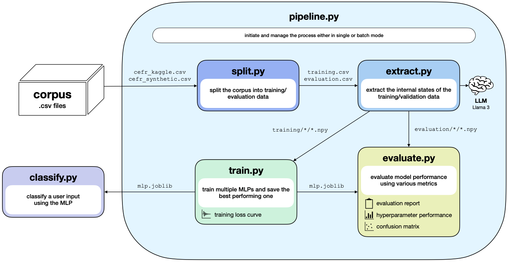
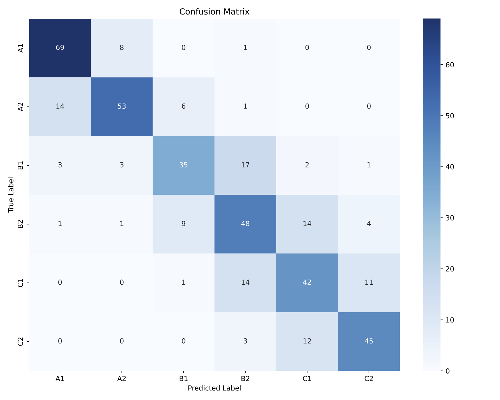

# DeepLL
Deep Language Leveler (DeepLL) classifies CEFR texts based on internal states of an LLM

## Pipeline

  

## Confusion Matrix (English Dataset)
The following confusion matrix was achieved on the English corpus. Further metrics can be found in the [evaluation report](evaluation_report.csv)

  

