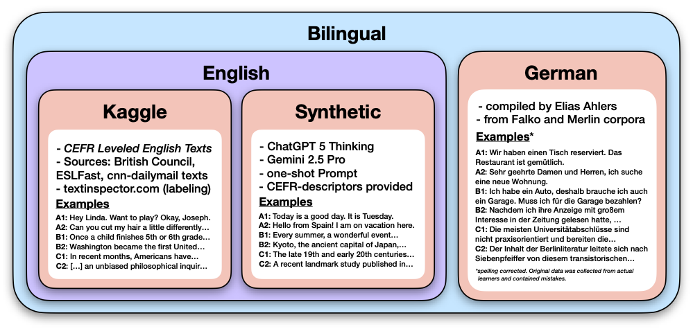

# `corpus/` - The Corpora Used for Training and Evaluation

Here is where the CEFR texts are located. The following diagram provides an overview of the five corpora with a brief description of the sources and example sentences.

  

